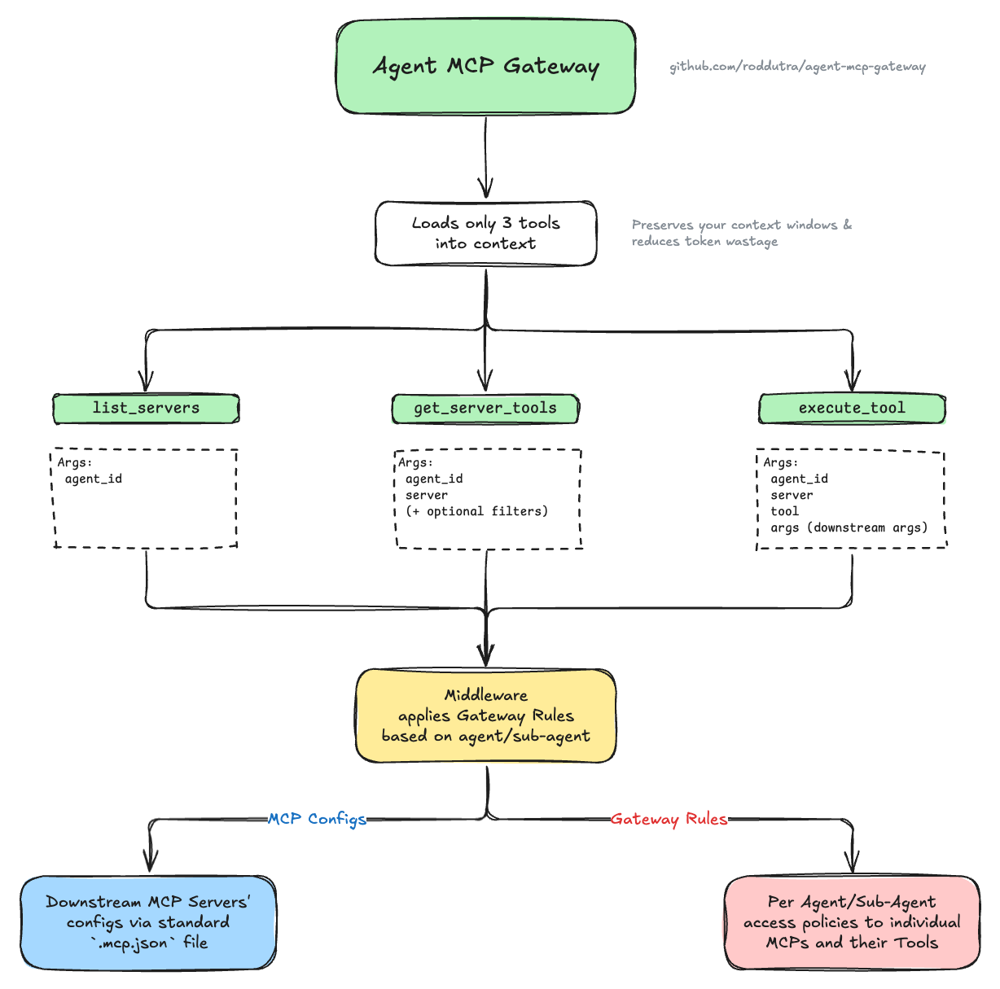

# Agent MCP Gateway

A [Model Context Protocol (MCP)](https://modelcontextprotocol.io) gateway that aggregates multiple MCP servers and provides policy-based access control for agents and subagents. Solves Claude Code's MCP context window waste by enabling on-demand tool discovery instead of loading all tool definitions upfront.

## Status

- ✅ **M0: Foundation** - Configuration, policy engine, audit logging, `list_servers` tool
- ✅ **M1: Core** - Proxy infrastructure, `get_server_tools`, `execute_tool`, middleware, metrics, hot reload, OAuth support
- 🚧 **M2: Production** - HTTP transport, health checks (planned)
- 🚧 **M3: DX** - Single-agent mode, config validation CLI, Docker (planned)

**Current Version:** M1-Core Complete (with OAuth)

## Table of Contents

- [Overview](#overview)
- [Quick Start](#quick-start)
- [Configuration](#configuration)
- [Usage](#usage)
- [Gateway Tools](#gateway-tools)
- [Security Considerations](#security-considerations)
- [Troubleshooting](#troubleshooting)
- [Testing](#testing)
- [Development](#development)
- [Architecture](#architecture)
- [Future Features](#future-features)
- [Documentation](#documentation)
- [Contributing](#contributing)
- [License](#license)
- [Support](#support)
- [Acknowledgments](#acknowledgments)

## Overview

### The Problem

When multiple MCP servers are configured in development environments (Claude Code, Cursor, VS Code), all tool definitions from all servers load into every agent's and subagent's context window at startup:

- 5,000-50,000+ tokens consumed upfront
- 80-95% of loaded tools never used by individual agents
- Context needed for actual work gets wasted on unused tool definitions

### The Solution

The Agent MCP Gateway acts as a single MCP server that proxies to multiple downstream MCP servers based on configurable per-agent rules:

- **3 gateway tools** load at startup (~400 tokens)
- Agents discover and request specific tools on-demand
- **90%+ context reduction**
- Policy-based access control per agent/subagent

### How It Works



The gateway sits between agents and downstream MCP servers, exposing only 3 lightweight tools. When an agent needs specific functionality, it discovers available servers and tools through the gateway, which filters visibility based on policy rules - agents only see servers and tools they have access to. This reduces each agent's context window to only relevant tools, while the gateway handles proxying authorized requests to downstream servers.

**[View detailed diagram with examples →](docs/diagram-full.png)** (includes downstream servers, tools, and gateway rules examples)

### Key Features

- ✅ **On-Demand Tool Discovery** - Load tool definitions only when needed
- ✅ **Per-Agent Access Control** - Configure which servers/tools each agent can access
- ✅ **Easy Agent Integration** - Simple template to add gateway support to any agent ([see guide](#configuring-agents-to-use-the-gateway))
- ✅ **Deny-Before-Allow Policies** - Explicit deny rules take precedence
- ✅ **Wildcard Support** - Pattern matching for tool names (`get_*`, `*_user`)
- ✅ **Session Isolation** - Concurrent requests don't interfere
- ✅ **Transparent Proxying** - Downstream servers unaware of gateway
- ✅ **Audit Logging** - All operations logged for monitoring
- ✅ **Performance Metrics** - Track latency and error rates per agent/operation
- ✅ **Hot Configuration Reload** - Update rules/servers without restart
- ✅ **Thread-Safe Operations** - Safe concurrent access during reloads
- ✅ **Diagnostic Tools** - Health monitoring via `get_gateway_status` (debug mode only)

## Quick Start

### Prerequisites

- Python 3.12+
- [uv](https://docs.astral.sh/uv/) (Python package manager)

### 1. Install Dependencies

```bash
# Clone the repository
git clone <repository-url>
cd agent-mcp-gateway

# Install dependencies with uv
uv sync
```

This installs:
- `fastmcp >= 2.13.0.1` - MCP server framework
- `pytest`, `pytest-cov`, `pytest-asyncio` - Testing tools (dev)

### 2. Set Up Configuration Files

```bash
cp config/.mcp.json.example .mcp.json
cp config/.mcp-gateway-rules.json.example .mcp-gateway-rules.json

# Edit configs with your servers and rules...
# Note: .mcp.json is the standard MCP config format used by Claude Code
```

### 3. Add Gateway to Your MCP Client

**Claude Code CLI:**
```bash
claude mcp add agent-mcp-gateway \
  uv run --directory /path/to/agent-mcp-gateway python main.py
```

**Manual MCP Client Configuration** (Claude Desktop, etc.):
```json
{
  "mcpServers": {
    "agent-mcp-gateway": {
      "command": "uv",
      "args": ["run", "--directory", "/path/to/agent-mcp-gateway", "python", "main.py"],
      "env": {
        "GATEWAY_DEFAULT_AGENT": "developer"
      }
    }
  }
}
```

Replace `/path/to/agent-mcp-gateway` with the actual path to your gateway installation.

**Note:** The `--directory` flag tells `uv run` to change to the project directory before running, ensuring it finds `pyproject.toml` and the gateway configuration files.

**Verify Gateway Connection:**

After adding the gateway to your MCP client, verify it's working:

```bash
# Using MCP Inspector (for testing)
npx @modelcontextprotocol/inspector uv run python main.py
# Then call list_servers with agent_id parameter

# Or ask your agent to list available servers
# Expected response: List of servers from your .mcp.json
```

Expected startup output:
```
Loading MCP server configuration from: .mcp.json
Loading gateway rules from: .mcp-gateway-rules.json
Gateway initialized successfully
  - X MCP server(s) configured
  - Y agent(s) configured
  - 3 gateway tools available
```

### 4. Development Usage (Optional)

For local development and testing:

```bash
# Run gateway directly
uv run python main.py

# Test with MCP Inspector
npx @modelcontextprotocol/inspector uv run python main.py
```

### 5. Configure Your Agents

The gateway's tool descriptions are self-documenting, but for proper access control you should configure how your agents identify themselves.

#### Choose Your Approach

**Approach 1: Single-Agent Mode (Simplest)**

If all your agents should have the same permissions, configure a default agent using either method:

**Option A: Environment Variable**
```bash
# Set in your MCP client configuration
export GATEWAY_DEFAULT_AGENT=developer
```
**Note:** The agent specified (e.g., "developer") must exist in your `.mcp-gateway-rules.json` file with appropriate permissions.

**Option B: "default" Agent in Rules**
```json
{
  "agents": {
    "default": {
      "allow": {
        "servers": ["*"]
      }
    }
  },
  "defaults": {
    "deny_on_missing_agent": false
  }
}
```
**Note:** Allowing all servers (`"servers": ["*"]`) without specifying tool restrictions grants access to all tools on all servers.

With either approach, agents can omit `agent_id` in tool calls - the gateway uses your configured default agent automatically.

**Approach 2: Multi-Agent Mode (Recommended for Access Control)**

For different agents with different permissions, configure each agent to pass its identity.

**Add this to your agent's system prompt** (e.g., `CLAUDE.md`, `.claude/agents/agent-name.md`):

```markdown
## MCP Gateway Access

**Available Tools (via agent-mcp-gateway):**

You have access to MCP servers through the agent-mcp-gateway. The specific servers and tools available to you are determined by the gateway's access control rules.

**Tool Discovery Process:**

When you need to use tools from downstream MCP servers:
1. Use `agent_id: "YOUR_AGENT_NAME"` in ALL gateway tool calls for proper access control
2. Call `list_servers` to discover which servers you have access to
3. Call `get_server_tools` with the specific server name to discover available tools
4. Use `execute_tool` to invoke tools with appropriate parameters
5. If you cannot access a tool you need, immediately notify the user

**Important:** Always include `agent_id: "YOUR_AGENT_NAME"` in your gateway tool calls. This ensures proper access control and audit logging.
```

Replace `YOUR_AGENT_NAME` with your agent's identifier (e.g., "researcher", "backend", "admin").

**Examples:** See [`.claude/agents/researcher.md`](.claude/agents/researcher.md) and [`.claude/agents/mcp-developer.md`](.claude/agents/mcp-developer.md) for complete configuration examples.

## Configuration

The gateway requires two configuration files:

### 1. MCP Servers Configuration

**File:** `.mcp.json` (or `config/.mcp.json`)

Defines the downstream MCP servers the gateway will proxy to. Uses the standard `.mcp.json` format compatible with Claude Code and other coding agents:

```json
{
  "mcpServers": {
    "brave-search": {
      "description": "Web search via Brave Search API",
      "command": "npx",
      "args": ["-y", "@modelcontextprotocol/server-brave-search"],
      "env": {
        "BRAVE_API_KEY": "${BRAVE_API_KEY}"
      }
    },
    "postgres": {
      "description": "PostgreSQL database access and query execution",
      "command": "uvx",
      "args": ["mcp-server-postgres"],
      "env": {
        "DATABASE_URL": "${DATABASE_URL}"
      }
    },
    "remote-server": {
      "description": "Custom remote API integration",
      "url": "https://example.com/mcp",
      "transport": "http",
      "headers": {
        "Authorization": "Bearer ${API_TOKEN}"
      }
    }
  }
}
```

**Server Descriptions (Recommended):**
Adding a `description` field to each server helps AI agents understand what each server provides and when to use it. Descriptions are always returned by `list_servers`, enabling agents to make informed decisions about which servers to query for tools. While optional, descriptions significantly improve agent tool discovery and decision-making.

**Supported Transports:**
- `stdio` - Local servers via npx/uvx (specified with `command` + `args`)
- `http` - Remote HTTP servers (specified with `url`)

**Environment Variables:**
- Use `${VAR_NAME}` syntax for environment variable substitution
- Set variables before running: `export BRAVE_API_KEY=your-key`

**Important - GUI Applications (Claude Desktop, etc.):**
If you use `${VAR_NAME}` syntax in `.mcp.json`, note that macOS GUI applications run in isolated environments without access to your shell's environment variables. For Claude Desktop and similar apps, add API keys to the gateway's `env` object in your MCP client configuration:

```json
{
  "mcpServers": {
    "agent-mcp-gateway": {
      "command": "uv",
      "args": ["run", "--directory", "/path/to/agent-mcp-gateway", "python", "main.py"],
      "env": {
        "BRAVE_API_KEY": "your-actual-key-here",
        "DATABASE_URL": "postgresql://...",
        "GATEWAY_DEFAULT_AGENT": "claude-desktop"
      }
    }
  }
}
```

(If you hardcode values directly in `.mcp.json` without `${VAR_NAME}` syntax, this is not necessary.)

### 2. Gateway Rules Configuration

**File:** `.mcp-gateway-rules.json` (or `config/.mcp-gateway-rules.json`)

Defines per-agent access policies using deny-before-allow precedence:

```json
{
  "agents": {
    "researcher": {
      "allow": {
        "servers": ["brave-search"],
        "tools": {
          "brave-search": ["*"]
        }
      }
    },
    "backend": {
      "allow": {
        "servers": ["postgres"],
        "tools": {
          "postgres": ["query", "list_*"]
        }
      },
      "deny": {
        "tools": {
          "postgres": ["drop_*", "truncate_*"]
        }
      }
    },
    "admin": {
      "allow": {
        "servers": ["*"],
        "tools": {
          "*": ["*"]
        }
      }
    },
    "default": {
      "deny": {
        "servers": ["*"]
      }
    }
  },
  "defaults": {
    "deny_on_missing_agent": false
  }
}
```

**Note on "default" Agent:** The special agent named "default" is used as a fallback when `agent_id` is not provided and `deny_on_missing_agent` is `false`. In this example, the default agent denies all servers, following the principle of least privilege. You can also use `GATEWAY_DEFAULT_AGENT` environment variable to specify a different default agent.

**Policy Precedence Order:**
1. Explicit deny rules (highest priority)
2. Explicit allow rules
3. Wildcard deny rules
4. Wildcard allow rules
5. Default policy (lowest priority)

**Configuration Flexibility:**
- Rules can reference servers not currently in `.mcp.json`
- Undefined server references treated as warnings (not errors)
- Allows keeping rules for temporarily removed servers
- Hot reload applies changes immediately without restart

**Wildcard Patterns:**
- `*` - Matches everything
- `get_*` - Matches tools starting with "get_"
- `*_user` - Matches tools ending with "_user"

**Agent Naming:**
- Use hierarchical names: `team.role` (e.g., `backend.database`, `frontend.ui`)
- Alphanumeric characters, hyphens, underscores, and dots allowed
- **Configure your agents** to pass their identity: See [Configuring Agents to Use the Gateway](#configuring-agents-to-use-the-gateway)

### Configuration Validation

The gateway validates configurations at startup and during hot reload:

```bash
uv run python main.py
# ✓ Configuration loaded from .mcp.json
# ⚠ Warning: Agent 'researcher' references undefined server 'unknown-server'
# ℹ These rules will be ignored until the server is added
```

**Validation Behavior:**
- Structural errors (invalid JSON, missing required fields) → Fail startup/reload
- Undefined server references → Log warnings, continue with valid rules
- Policy conflicts → Deny-before-allow precedence resolves automatically

### 3. OAuth Support for Downstream Servers

OAuth-protected downstream servers (Notion, GitHub) are automatically supported via auto-detection when servers return HTTP 401. The gateway uses FastMCP's OAuth support to handle authentication flows transparently - browser opens once for initial authentication, then tokens are cached for future use. See [OAuth User Guide](docs/oauth-user-guide.md) for detailed setup and troubleshooting.

### 4. Environment Variables Reference

| Variable | Description | Default | Example |
|----------|-------------|---------|---------|
| `GATEWAY_MCP_CONFIG` | Path to MCP servers configuration file | `.mcp.json`, fallback: `./config/.mcp.json` | `export GATEWAY_MCP_CONFIG=./custom.json` |
| `GATEWAY_RULES` | Path to gateway rules configuration file | `.mcp-gateway-rules.json`, fallback: `./config/.mcp-gateway-rules.json` | `export GATEWAY_RULES=~/.claude/rules.json` |
| `GATEWAY_DEFAULT_AGENT` | Default agent identity when `agent_id` not provided (optional) | None | `export GATEWAY_DEFAULT_AGENT=developer` |
| `GATEWAY_DEBUG` | Enable debug mode to expose `get_gateway_status` tool | `false` | `export GATEWAY_DEBUG=true` |
| `GATEWAY_AUDIT_LOG` | Path to audit log file | `./logs/audit.jsonl` | `export GATEWAY_AUDIT_LOG=./audit.jsonl` |
| `GATEWAY_TRANSPORT` | Transport protocol (stdio or http) | `stdio` | `export GATEWAY_TRANSPORT=stdio` |
| `GATEWAY_INIT_STRATEGY` | Initialization strategy (eager or lazy) | `eager` | `export GATEWAY_INIT_STRATEGY=eager` |

**Note on GUI Applications:** macOS GUI applications (Claude Desktop, etc.) run in isolated environments without access to shell environment variables. If using `${VAR_NAME}` syntax in `.mcp.json`, add required API keys to the gateway's `env` object in your MCP client configuration.

## Usage

### Starting the Gateway

**In MCP Clients (Recommended):**

Add to your MCP client configuration (e.g., Claude Desktop config):
```json
{
  "mcpServers": {
    "agent-mcp-gateway": {
      "command": "uv",
      "args": ["run", "--directory", "/path/to/agent-mcp-gateway", "python", "main.py"],
      "env": {
        "GATEWAY_MCP_CONFIG": ".mcp.json",
        "GATEWAY_RULES": ".mcp-gateway-rules.json"
      }
    }
  }
}
```

Or use Claude Code CLI:
```bash
claude mcp add agent-mcp-gateway \
  uv run --directory /path/to/agent-mcp-gateway python main.py
```

**For Development/Testing:**

```bash
# Use default config paths
uv run python main.py

# Or specify custom paths via environment (see Configuration section for all variables)
export GATEWAY_MCP_CONFIG=./custom-mcp-config.json
export GATEWAY_RULES=./custom-gateway-rules.json
uv run python main.py
```

### Startup Output

```
Loading MCP server configuration from: .mcp.json
Loading gateway rules from: .mcp-gateway-rules.json
Audit log will be written to: ./logs/audit.jsonl

Initializing proxy connections to downstream servers...
  - 2 proxy client(s) initialized
    * brave-search: ready
    * postgres: ready
  - Metrics collector initialized
  - Access control middleware registered

Agent MCP Gateway initialized successfully
  - 2 MCP server(s) configured
  - 3 agent(s) configured
  - Default policy: deny unknown agents
  - 3 gateway tools available: list_servers, get_server_tools, execute_tool
  (4 tools if GATEWAY_DEBUG=true: includes get_gateway_status)

Gateway is ready. Running with stdio transport...
```

## Gateway Tools

The gateway exposes exactly 3 tools to agents. All tools accept an optional `agent_id` parameter for access control. When `agent_id` is not provided, the gateway uses a fallback chain to determine agent identity (see [Agent Identity Modes](#agent-identity-modes)).

**For Agent Developers:** To configure your agents to properly use these gateway tools with access control, see [Configuring Agents to Use the Gateway](#configuring-agents-to-use-the-gateway).

### 1. `list_servers`

Lists MCP servers available to the calling agent based on policy rules.

**Parameters:**
- `agent_id` (string, optional) - Identifier of the agent making the request (see [Agent Identity Modes](#agent-identity-modes))
- `include_metadata` (boolean, optional) - Include technical details like transport, command, and url (default: false)

**Returns:**
```json
[
  {
    "name": "brave-search",
    "description": "Web search via Brave Search API"
  },
  {
    "name": "postgres",
    "description": "PostgreSQL database access and query execution"
  }
]
```

**With `include_metadata=true`:**
```json
[
  {
    "name": "brave-search",
    "description": "Web search via Brave Search API",
    "transport": "stdio",
    "command": "npx"
  },
  {
    "name": "postgres",
    "description": "PostgreSQL database access and query execution",
    "transport": "stdio",
    "command": "uvx"
  }
]
```

**Note:** Server descriptions are always included (when configured in `.mcp.json`) to help agents understand what each server provides. The `include_metadata` flag only controls whether technical details (transport, command, url) are included.

**Example:**
```python
# Basic usage - returns names and descriptions
result = await client.call_tool("list_servers", {
    "agent_id": "researcher"
})

# With technical metadata
result = await client.call_tool("list_servers", {
    "agent_id": "researcher",
    "include_metadata": True
})
```

### 2. `get_server_tools`

Retrieves tool definitions from a specific MCP server, filtered by agent permissions.

**Parameters:**
- `agent_id` (string, optional) - Identifier of the agent (see [Agent Identity Modes](#agent-identity-modes))
- `server` (string, required) - Name of the downstream MCP server
- `names` (string, optional) - Comma-separated list of tool names (e.g., `"tool1,tool2,tool3"`) or single tool name
- `pattern` (string, optional) - Wildcard pattern for tool names (e.g., `"get_*"`)
- `max_schema_tokens` (integer, optional) - Token budget limit for schemas

**Returns:**
```json
{
  "tools": [
    {
      "name": "brave_web_search",
      "description": "Search the web using Brave Search",
      "inputSchema": {
        "type": "object",
        "properties": {
          "query": {"type": "string"}
        },
        "required": ["query"]
      }
    }
  ],
  "server": "brave-search",
  "total_available": 5,
  "returned": 1,
  "tokens_used": 150
}
```

**Example:**
```python
# Get all allowed tools
tools = await client.call_tool("get_server_tools", {
    "agent_id": "researcher",
    "server": "brave-search"
})

# Get specific tools by name (comma-separated)
tools = await client.call_tool("get_server_tools", {
    "agent_id": "researcher",
    "server": "brave-search",
    "names": "brave_web_search,brave_local_search"
})

# Get specific tools by pattern
tools = await client.call_tool("get_server_tools", {
    "agent_id": "backend",
    "server": "postgres",
    "pattern": "get_*"
})

# Limit token usage
tools = await client.call_tool("get_server_tools", {
    "agent_id": "researcher",
    "server": "brave-search",
    "max_schema_tokens": 1000
})
```

### 3. `execute_tool`

Executes a tool on a downstream MCP server with transparent result forwarding.

**Parameters:**
- `agent_id` (string, optional) - Identifier of the agent (see [Agent Identity Modes](#agent-identity-modes))
- `server` (string, required) - Name of the downstream MCP server
- `tool` (string, required) - Name of the tool to execute
- `args` (object, required) - Arguments to pass to the tool
- `timeout_ms` (integer, optional) - Timeout in milliseconds

**Returns:**
```json
{
  "content": [
    {
      "type": "text",
      "text": "Search results: ..."
    }
  ],
  "isError": false
}
```

**Example:**
```python
# Execute a tool
result = await client.call_tool("execute_tool", {
    "agent_id": "researcher",
    "server": "brave-search",
    "tool": "brave_web_search",
    "args": {
        "query": "FastMCP documentation"
    }
})

# With timeout
result = await client.call_tool("execute_tool", {
    "agent_id": "backend",
    "server": "postgres",
    "tool": "query",
    "args": {
        "sql": "SELECT * FROM users LIMIT 10"
    },
    "timeout_ms": 5000
})
```

### 4. `get_gateway_status` (Debug Mode Only)

Returns comprehensive gateway health and diagnostics information.

**Important:** This tool is only available when debug mode is enabled (via `GATEWAY_DEBUG=true` environment variable or `--debug` CLI flag). See [Security Considerations](#security-considerations) for details.

**Parameters:**
- `agent_id` (string, optional) - Identifier of the agent (see [Agent Identity Modes](#agent-identity-modes))

**Returns:**
```json
{
  "reload_status": {
    "mcp_config": {
      "last_attempt": "2025-10-30T10:30:00Z",
      "last_success": "2025-10-30T10:30:00Z",
      "last_error": null,
      "attempt_count": 1,
      "success_count": 1
    },
    "gateway_rules": {
      "last_attempt": "2025-10-30T10:35:00Z",
      "last_success": "2025-10-30T10:35:00Z",
      "last_error": null,
      "attempt_count": 2,
      "success_count": 2,
      "last_warnings": []
    }
  },
  "policy_state": {
    "total_agents": 3,
    "agent_ids": ["researcher", "backend", "admin"],
    "defaults": {"deny_on_missing_agent": true}
  },
  "available_servers": ["brave-search", "postgres"],
  "config_paths": {
    "mcp_config": "/path/to/.mcp.json",
    "gateway_rules": "/path/to/.mcp-gateway-rules.json"
  },
  "message": "Gateway is operational. Check reload_status for hot reload health."
}
```

**Example:**
```python
# Check gateway health and reload status (requires GATEWAY_DEBUG=true)
status = await client.call_tool("get_gateway_status", {
    "agent_id": "admin"
})

# Verify last reload was successful
if status["reload_status"]["gateway_rules"]["last_error"]:
    print("Warning: Last rule reload failed!")
```

### Error Handling

All tools return structured errors with clear messages:

```json
{
  "error": {
    "code": "DENIED_BY_POLICY",
    "message": "Agent 'frontend' denied access to tool 'drop_table'",
    "rule": "agents.frontend.deny.tools.postgres[0]"
  }
}
```

**Error Codes:**
- `DENIED_BY_POLICY` - Agent lacks permission
- `SERVER_UNAVAILABLE` - Downstream server unreachable
- `TOOL_NOT_FOUND` - Requested tool doesn't exist
- `TIMEOUT` - Operation exceeded time limit
- `INVALID_AGENT_ID` - Missing or unknown agent identifier
- `FALLBACK_AGENT_NOT_IN_RULES` - Configured fallback agent not found in gateway rules
- `NO_FALLBACK_CONFIGURED` - No agent_id provided and no fallback agent configured

### Complete Workflow Example

Here's a minimal working example showing the typical gateway workflow:

```python
from fastmcp import Client

async def gateway_workflow():
    async with Client('agent-mcp-gateway') as client:
        # 1. Discover available servers
        servers = await client.call_tool('list_servers', {
            'agent_id': 'researcher'
        })
        # Response: [{"name": "brave-search", "description": "Web search..."}]

        # 2. Get tools from specific server
        tools = await client.call_tool('get_server_tools', {
            'agent_id': 'researcher',
            'server': 'brave-search'
        })
        # Response: {"tools": [...], "server": "brave-search", ...}

        # 3. Execute a tool
        result = await client.call_tool('execute_tool', {
            'agent_id': 'researcher',
            'server': 'brave-search',
            'tool': 'brave_web_search',
            'args': {'query': 'MCP protocol documentation'}
        })
        # Response: {"content": [...search results...], "isError": false}
```

This workflow demonstrates on-demand tool discovery - load definitions only when needed, not upfront.

### Agent Identity Modes

The gateway supports two deployment modes for handling agent identity:

#### Single-Agent Mode

Use when all agents should have the same permissions (development, personal use, single-agent deployments):

```bash
# Set default agent via environment variable
export GATEWAY_DEFAULT_AGENT=developer
```

Or define a "default" agent in rules:
```json
{
  "agents": {
    "default": {
      "allow": {"servers": ["brave-search", "postgres"]}
    }
  },
  "defaults": {
    "deny_on_missing_agent": false
  }
}
```

Agents can omit `agent_id` in tool calls - the gateway automatically uses the configured default.

#### Multi-Agent Mode

Use when different agents need different permissions (production, multi-agent systems):

```json
{
  "agents": {
    "researcher": {"allow": {"servers": ["brave-search"]}},
    "backend": {"allow": {"servers": ["postgres"]}}
  },
  "defaults": {
    "deny_on_missing_agent": true  // Require explicit agent_id
  }
}
```

Configure each agent to pass their identity (see [Configuring Agents to Use the Gateway](#configuring-agents-to-use-the-gateway)).

<details>
<summary><strong>Technical Details: Agent Identity Resolution</strong></summary>

When `agent_id` is not provided, the gateway uses this fallback chain:

1. `GATEWAY_DEFAULT_AGENT` environment variable (highest priority)
2. Agent named "default" in `.mcp-gateway-rules.json`
3. Error if neither configured

The `deny_on_missing_agent` setting controls this behavior:
- `true`: Require explicit `agent_id` (bypass fallback chain)
- `false`: Use fallback chain when `agent_id` omitted

**Security Note:** The fallback mechanism follows the principle of least privilege - it never grants implicit "allow all" access, only the explicitly configured agent's permissions.

</details>

## Security Considerations

**Rules File Location:** Store `.mcp-gateway-rules.json` in-project for context optimization only. For production access control, store outside project directory (e.g., `~/.claude/mcp-gateway-rules.json`) to prevent agents from reading/modifying permissions.

**Debug Mode:** The `get_gateway_status` tool exposes gateway internals and is only available when `GATEWAY_DEBUG=true`. Disable in production environments.

**For comprehensive security guidance:** See [Security Guide](docs/security-guide.md) for detailed information on rules file security, debug mode considerations, agent impersonation risks, and production best practices.

## Troubleshooting

### Gateway Won't Start

**Symptom:** Error on startup or gateway fails to initialize

**Solutions:**
- **Check configuration files exist:** Verify `.mcp.json` and `.mcp-gateway-rules.json` are in the expected location
- **Validate JSON syntax:** Use `python -m json.tool < .mcp.json` to check for syntax errors
- **Check Python version:** Ensure Python 3.12+ is installed (`python --version`)
- **Verify dependencies:** Run `uv sync` to ensure all packages are installed

### Can't Connect to Downstream Server

**Symptom:** `SERVER_UNAVAILABLE` error when calling tools

**Solutions:**
- **Verify server configuration:** Check server is properly defined in `.mcp.json`
- **Test stdio servers:** Ensure command is available (`npx --version`, `uvx --version`)
- **Check environment variables:** Verify API keys and credentials are set
- **Test HTTP servers:** Try accessing server URL directly in browser
- **Review startup logs:** Look for server initialization errors in gateway output

### Permission Denied Errors

**Symptom:** `DENIED_BY_POLICY` when agent tries to use a tool

**Solutions:**
- **Verify agent_id:** Ensure agent is passing correct identity (check audit logs)
- **Check agent rules:** Confirm agent exists in `.mcp-gateway-rules.json`
- **Review policy precedence:** Remember deny rules take precedence over allow rules
- **Test with wildcard:** Try `"tools": {"server-name": ["*"]}` to grant broad access temporarily
- **Enable debug mode:** Use `GATEWAY_DEBUG=true` and call `get_gateway_status` to inspect policy state

### OAuth Authentication Issues

**Symptom:** Browser doesn't open or OAuth flow fails

See detailed troubleshooting in [OAuth User Guide](docs/oauth-user-guide.md).

Quick fixes:
- **Clear token cache:** `rm -rf ~/.fastmcp/oauth-mcp-client-cache/`
- **Test browser:** `python -m webbrowser https://example.com`
- **Check server URL:** Verify correct OAuth server URL in `.mcp.json`

### Hot Reload Not Working

**Symptom:** Changes to config files don't take effect

**Solutions:**
- **Check file watch:** Ensure config files are in expected locations
- **Review logs:** Look for reload errors in gateway output
- **Manual reload:** Send SIGHUP signal or restart gateway
- **Debug mode:** Use `get_gateway_status` to check last reload timestamps

**For additional help:** See [Security Guide](docs/security-guide.md), [OAuth User Guide](docs/oauth-user-guide.md), or open a GitHub issue.

## Testing

### Running Tests

```bash
# Run all tests
uv run pytest

# Run with coverage
uv run pytest --cov=src --cov-report=term

# Run specific test file
uv run pytest tests/test_gateway.py -v

# Run integration tests only
uv run pytest tests/test_integration_m1.py -v
```

### Testing with MCP Inspector

The [MCP Inspector](https://github.com/modelcontextprotocol/inspector) is an interactive developer tool for testing and debugging MCP servers.

#### Install and Run

```bash
# Run Inspector with the gateway (no installation needed)
npx @modelcontextprotocol/inspector uv run python main.py
```

This opens a web interface where you can:
1. Connect to the gateway via stdio transport
2. View all three gateway tools
3. Test each tool with custom parameters
4. Inspect request/response messages
5. Monitor logs and notifications

#### Testing Gateway Tools in Inspector

**1. Test `list_servers`:**
```json
{
  "agent_id": "researcher"
}
```

Expected: List of servers the "researcher" agent can access.

**2. Test `get_server_tools`:**
```json
{
  "agent_id": "researcher",
  "server": "brave-search"
}
```

Expected: Tool definitions from brave-search server.

**3. Test `execute_tool`:**
```json
{
  "agent_id": "researcher",
  "server": "brave-search",
  "tool": "brave_web_search",
  "args": {
    "query": "test query"
  }
}
```

Expected: Search results from Brave (if server configured and running).

#### Inspector Features

- **Tools Tab**: View all gateway tools with schemas
- **Test Execution**: Call tools with custom inputs
- **Message Pane**: See raw JSON-RPC messages
- **Logs**: Monitor server logs and notifications
- **Connection**: Verify gateway startup and initialization

#### Troubleshooting with Inspector

If tools fail:
1. Check the **Logs pane** for error messages
2. Verify your `agent_id` exists in `.mcp-gateway-rules.json`
3. Confirm downstream servers are configured in `.mcp.json`
4. Check that required environment variables are set
5. Review the **Message pane** for policy denial reasons

### Manual Testing (without Inspector)

```bash
# Run the existing integration test
uv run python test_integration.py

# Or use FastMCP Client directly
uv run python -c "
import asyncio
from fastmcp import Client

async def test():
    async with Client('main.py') as client:
        result = await client.call_tool('list_servers', {'agent_id': 'researcher'})
        print(result)

asyncio.run(test())
"
```

## Development

### Project Structure

```
agent-mcp-gateway/
├── src/                          # Core gateway implementation
├── tests/                        # Test suite
├── config/                       # Configuration examples
├── docs/                         # Documentation and specifications
├── main.py                       # Entry point
└── pyproject.toml                # Python dependencies
```

### Adding a New Feature

1. **Update specs**: Document in relevant milestone file
2. **Write tests first**: Create test file in `tests/`
3. **Implement feature**: Add code in `src/`
4. **Run tests**: `uv run pytest`
5. **Check coverage**: `uv run pytest --cov=src`
6. **Update docs**: Document in README and relevant files
7. **Commit**: Follow commit message format

### Running in Development

```bash
# Run with verbose logging
uv run python main.py

# Run tests in watch mode
uv run pytest-watch

# Generate coverage report
uv run pytest --cov=src --cov-report=html
open htmlcov/index.html
```

### Code Style

- Follow existing patterns in M0/M1 code
- Use type hints throughout
- Write docstrings for all public functions
- Keep functions focused and testable
- Add tests for all new functionality

## Architecture

### Component Diagram

```
┌─────────────────────────────────────────────────────────┐
│                    Agent / Client                        │
└─────────────────────┬───────────────────────────────────┘
                      │
                      ▼
┌─────────────────────────────────────────────────────────┐
│              Agent MCP Gateway                           │
│  ┌───────────────────────────────────────────────────┐  │
│  │  Gateway Tools (3 tools, ~400 tokens)            │  │
│  │  • list_servers                                   │  │
│  │  • get_server_tools                               │  │
│  │  • execute_tool                                   │  │
│  └───────────────────────────────────────────────────┘  │
│                      │                                   │
│  ┌─────────────────────────────────────────────────┐    │
│  │  AgentAccessControl Middleware                   │    │
│  │  • Extract agent_id                              │    │
│  │  • Validate permissions                          │    │
│  └─────────────────────────────────────────────────┘    │
│                      │                                   │
│  ┌─────────────────────────────────────────────────┐    │
│  │  PolicyEngine                                    │    │
│  │  • Deny-before-allow precedence                 │    │
│  │  • Wildcard matching                            │    │
│  └─────────────────────────────────────────────────┘    │
│                      │                                   │
│  ┌─────────────────────────────────────────────────┐    │
│  │  ProxyManager                                    │    │
│  │  • Session isolation                             │    │
│  │  • Connection pooling                            │    │
│  └─────────────────────────────────────────────────┘    │
│                      │                                   │
│  ┌─────────────────────────────────────────────────┐    │
│  │  AuditLogger & MetricsCollector                  │    │
│  └─────────────────────────────────────────────────┘    │
└──────────────────────┬───────────────────────────────────┘
                       │
         ┌─────────────┼─────────────┐
         ▼             ▼              ▼
   ┌─────────┐   ┌─────────┐   ┌─────────┐
   │ Server  │   │ Server  │   │ Server  │
   │   A     │   │   B     │   │   C     │
   │ (stdio) │   │ (stdio) │   │ (HTTP)  │
   └─────────┘   └─────────┘   └─────────┘
```

### Request Flow

1. **Agent sends request** to gateway tool with `agent_id`
2. **Middleware intercepts**: Extracts and validates `agent_id`
3. **Tool validates**: Checks PolicyEngine for server/tool access
4. **Proxy forwards**: ProxyManager routes to downstream server
5. **Session isolated**: Each request gets fresh connection
6. **Result returns**: Transparently forwarded to agent
7. **Audit logged**: Operation recorded with metrics

### Performance Characteristics

- **Context reduction**: 90%+ (400 tokens vs 5,000-50,000+)
- **Added latency**: <100ms (P95)
- **Gateway overhead**: <30ms per operation
- **Session isolation**: Automatic per-request
- **Concurrent requests**: Fully supported

## Future Features

### M2: Production (Planned)

🚧 **Status:** Not yet implemented

**Features:**
- [ ] HTTP transport for gateway server
- [ ] Health check endpoints
- [ ] Enhanced error handling
- [ ] Metrics export API
- [ ] Connection pooling optimization
- [ ] Rate limiting

**When available:**
```bash
# Run with HTTP transport
export GATEWAY_TRANSPORT=http
export GATEWAY_PORT=8080
uv run python main.py

# Health check endpoint
curl http://localhost:8080/health

# Metrics endpoint
curl http://localhost:8080/metrics
```

### M3: Developer Experience (Planned)

🚧 **Status:** Not yet implemented

**Features:**
- [ ] Single-agent mode (bypass agent_id requirement)
- [ ] Config validation CLI tool
- [ ] Docker container with examples
- [ ] Interactive setup wizard
- [ ] VS Code extension

**When available:**
```bash
# Single-agent mode (no agent_id required)
export GATEWAY_DEFAULT_AGENT=developer
uv run python main.py

# Validate configs
uv run python -m src.cli validate

# Run with Docker
docker run -v ./config:/config agent-mcp-gateway
```

## Documentation

- [Product Requirements Document](docs/specs/PRD.md)
- [M0: Foundation Spec](docs/specs/m0-foundation.md)
- [M0: Success Report](docs/milestones/m0-success-report.md)
- [M1: Core Spec](docs/specs/m1-core.md)
- [M1: Success Report](docs/milestones/m1-success-report.md)
- [FastMCP Implementation Guide](docs/fastmcp-implementation-guide.md)
- [Claude Code Subagent Limitations](docs/claude-code-subagent-mcp-limitations.md)

## Contributing

Contributions welcome! Please:

1. Read the [PRD](docs/specs/PRD.md) and relevant milestone specs
2. Follow the existing code style and patterns
3. Write tests for all new functionality
4. Ensure all tests pass: `uv run pytest`
5. Update documentation as needed
6. Submit a pull request with clear description

## License

This project is licensed under the MIT License - see the [LICENSE](LICENSE) file for details.

## Support

For issues and questions:
- GitHub Issues: [Create an issue](link-to-issues)
- Documentation: [docs/specs/](docs/specs/)
- MCP Specification: https://modelcontextprotocol.io

## Acknowledgments

Built with:
- [FastMCP](https://gofastmcp.com/) - MCP server framework
- [Model Context Protocol](https://modelcontextprotocol.io/) - Protocol specification
