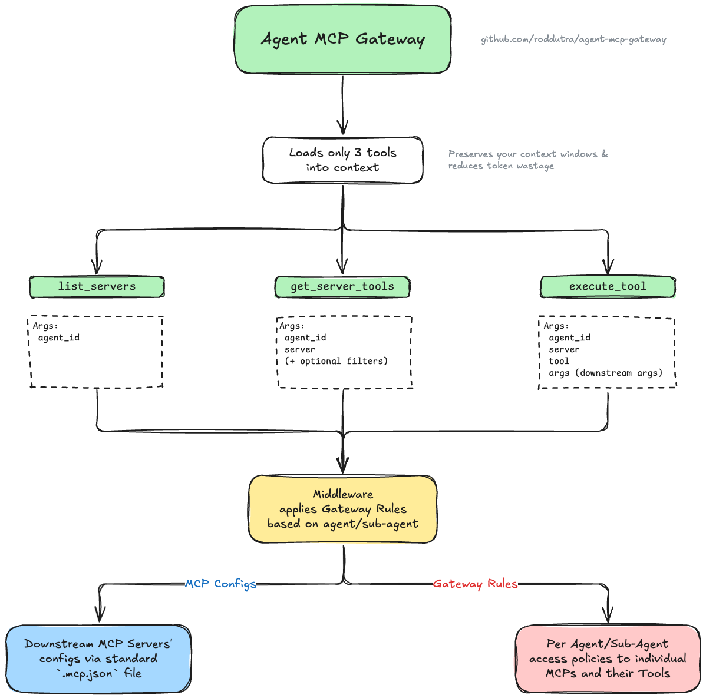

# Agent MCP Gateway

An MCP gateway that aggregates multiple MCP servers and provides policy-based access control for agents and subagents. Solves Claude Code's MCP context window waste by enabling on-demand tool discovery instead of loading all tool definitions upfront.

## Status

- ✅ **M0: Foundation** - Configuration, policy engine, audit logging, `list_servers` tool
- ✅ **M1: Core** - Proxy infrastructure, `get_server_tools`, `execute_tool`, middleware, metrics, hot reload
- 🚧 **M2: Production** - HTTP transport, health checks (planned)
- 🚧 **M3: DX** - Single-agent mode, config validation CLI, Docker (planned)

**Current Version:** M1-Core Complete

---

## Table of Contents

- [Overview](#overview)
- [Quick Start](#quick-start)
- [Installation](#installation)
- [Configuration](#configuration)
- [Usage](#usage)
- [Gateway Tools](#gateway-tools)
- [Testing](#testing)
- [Development](#development)
- [Architecture](#architecture)

---

## Overview

### The Problem

When multiple MCP servers are configured in development environments (Claude Code, Cursor, VS Code), all tool definitions from all servers load into every agent's and subagent's context window at startup:

- 5,000-50,000+ tokens consumed upfront
- 80-95% of loaded tools never used by individual agents
- Context needed for actual work gets wasted on unused tool definitions

### The Solution

The Agent MCP Gateway acts as a single MCP server that proxies to multiple downstream MCP servers based on configurable per-agent rules:

- **3 gateway tools** load at startup (~400 tokens)
- Agents discover and request specific tools on-demand
- **90%+ context reduction**
- Policy-based access control per agent/subagent

### How It Works



The gateway sits between agents and downstream MCP servers, exposing only 3 lightweight tools. When an agent needs specific functionality, it discovers available servers and tools through the gateway, which filters visibility based on policy rules - agents only see servers and tools they have access to. This reduces each agent's context window to only relevant tools, while the gateway handles proxying authorized requests to downstream servers.

**[View detailed diagram with examples →](docs/diagram-full.png)** (includes downstream servers, tools, and gateway rules examples)

### Key Features

- ✅ **On-Demand Tool Discovery** - Load tool definitions only when needed
- ✅ **Per-Agent Access Control** - Configure which servers/tools each agent can access
- ✅ **Deny-Before-Allow Policies** - Explicit deny rules take precedence
- ✅ **Wildcard Support** - Pattern matching for tool names (`get_*`, `*_user`)
- ✅ **Session Isolation** - Concurrent requests don't interfere
- ✅ **Transparent Proxying** - Downstream servers unaware of gateway
- ✅ **Audit Logging** - All operations logged for monitoring
- ✅ **Performance Metrics** - Track latency and error rates per agent/operation
- ✅ **Hot Configuration Reload** - Update rules/servers without restart
- ✅ **Thread-Safe Operations** - Safe concurrent access during reloads
- ✅ **Diagnostic Tools** - Health monitoring via `get_gateway_status` (debug mode only)

---

## Quick Start

### 1. Install Dependencies

```bash
uv sync
```

### 2. Set Up Configuration Files

```bash
cp config/.mcp.json.example .mcp.json
cp config/.mcp-gateway-rules.json.example .mcp-gateway-rules.json

# Edit configs with your servers and rules...
# Note: .mcp.json is the standard MCP config format used by Claude Code
```

### 3. Add Gateway to Your MCP Client

**Claude Code CLI:**
```bash
claude mcp add agent-mcp-gateway \
  uv run --directory /path/to/agent-mcp-gateway python main.py
```

**Manual MCP Client Configuration** (Claude Desktop, etc.):
```json
{
  "mcpServers": {
    "agent-mcp-gateway": {
      "command": "uv",
      "args": ["run", "--directory", "/path/to/agent-mcp-gateway", "python", "main.py"],
      "env": {
        "GATEWAY_DEFAULT_AGENT": "developer"
      }
    }
  }
}
```

Replace `/path/to/agent-mcp-gateway` with the actual path to your gateway installation.

**Note:** The `--directory` flag tells `uv run` to change to the project directory before running, ensuring it finds `pyproject.toml` and the gateway configuration files.

### 4. Development Usage (Optional)

For local development and testing:

```bash
# Run gateway directly
uv run python main.py

# Test with MCP Inspector
npx @modelcontextprotocol/inspector uv run python main.py
```

---

## Installation

### Prerequisites

- Python 3.12+
- [uv](https://docs.astral.sh/uv/) (Python package manager)

### Install Dependencies

```bash
# Clone the repository
git clone <repository-url>
cd agent-mcp-gateway

# Install dependencies with uv
uv sync
```

This installs:
- `fastmcp >= 2.13.0.1` - MCP server framework
- `pytest`, `pytest-cov`, `pytest-asyncio` - Testing tools (dev)

---

## Configuration

The gateway requires two configuration files:

### 1. MCP Servers Configuration

**File:** `.mcp.json` (or `config/.mcp.json`)

Defines the downstream MCP servers the gateway will proxy to. Uses the standard `.mcp.json` format compatible with Claude Code and other coding agents:

```json
{
  "mcpServers": {
    "brave-search": {
      "command": "npx",
      "args": ["-y", "@modelcontextprotocol/server-brave-search"],
      "env": {
        "BRAVE_API_KEY": "${BRAVE_API_KEY}"
      }
    },
    "postgres": {
      "command": "uvx",
      "args": ["mcp-server-postgres"],
      "env": {
        "DATABASE_URL": "${DATABASE_URL}"
      }
    },
    "remote-server": {
      "url": "https://example.com/mcp",
      "transport": "http",
      "headers": {
        "Authorization": "Bearer ${API_TOKEN}"
      }
    }
  }
}
```

**Supported Transports:**
- `stdio` - Local servers via npx/uvx (specified with `command` + `args`)
- `http` - Remote HTTP servers (specified with `url`)

**Environment Variables:**
- Use `${VAR_NAME}` syntax for environment variable substitution
- Set variables before running: `export BRAVE_API_KEY=your-key`

### 2. Gateway Rules Configuration

**File:** `.mcp-gateway-rules.json` (or `config/.mcp-gateway-rules.json`)

Defines per-agent access policies using deny-before-allow precedence:

```json
{
  "agents": {
    "researcher": {
      "allow": {
        "servers": ["brave-search"],
        "tools": {
          "brave-search": ["*"]
        }
      }
    },
    "backend": {
      "allow": {
        "servers": ["postgres"],
        "tools": {
          "postgres": ["query", "list_*"]
        }
      },
      "deny": {
        "tools": {
          "postgres": ["drop_*", "truncate_*"]
        }
      }
    },
    "admin": {
      "allow": {
        "servers": ["*"],
        "tools": {
          "*": ["*"]
        }
      }
    },
    "default": {
      "deny": {
        "servers": ["*"]
      }
    }
  },
  "defaults": {
    "deny_on_missing_agent": false
  }
}
```

**Note on "default" Agent:** The special agent named "default" is used as a fallback when `agent_id` is not provided and `deny_on_missing_agent` is `false`. In this example, the default agent denies all servers, following the principle of least privilege. You can also use `GATEWAY_DEFAULT_AGENT` environment variable to specify a different default agent.

**Policy Precedence Order:**
1. Explicit deny rules (highest priority)
2. Explicit allow rules
3. Wildcard deny rules
4. Wildcard allow rules
5. Default policy (lowest priority)

**Configuration Flexibility:**
- Rules can reference servers not currently in `.mcp.json`
- Undefined server references treated as warnings (not errors)
- Allows keeping rules for temporarily removed servers
- Hot reload applies changes immediately without restart

**Wildcard Patterns:**
- `*` - Matches everything
- `get_*` - Matches tools starting with "get_"
- `*_user` - Matches tools ending with "_user"

**Agent Naming:**
- Use hierarchical names: `team.role` (e.g., `backend.database`, `frontend.ui`)
- Alphanumeric characters, hyphens, underscores, and dots allowed

### Configuration Validation

The gateway validates configurations at startup and during hot reload:

```bash
uv run python main.py
# ✓ Configuration loaded from .mcp.json
# ⚠ Warning: Agent 'researcher' references undefined server 'unknown-server'
# ℹ These rules will be ignored until the server is added
```

**Validation Behavior:**
- Structural errors (invalid JSON, missing required fields) → Fail startup/reload
- Undefined server references → Log warnings, continue with valid rules
- Policy conflicts → Deny-before-allow precedence resolves automatically

---

## Usage

### Starting the Gateway

**In MCP Clients (Recommended):**

Add to your MCP client configuration (e.g., Claude Desktop config):
```json
{
  "mcpServers": {
    "agent-mcp-gateway": {
      "command": "uv",
      "args": ["run", "--directory", "/path/to/agent-mcp-gateway", "python", "main.py"],
      "env": {
        "GATEWAY_MCP_CONFIG": ".mcp.json",
        "GATEWAY_RULES": ".mcp-gateway-rules.json"
      }
    }
  }
}
```

Or use Claude Code CLI:
```bash
claude mcp add agent-mcp-gateway \
  uv run --directory /path/to/agent-mcp-gateway python main.py
```

**For Development/Testing:**

```bash
# Use default config paths
uv run python main.py

# Or specify custom paths via environment
export GATEWAY_MCP_CONFIG=./custom-mcp-config.json
export GATEWAY_RULES=./custom-gateway-rules.json
export GATEWAY_AUDIT_LOG=./custom-audit.jsonl
uv run python main.py
```

**Environment Variables:**
- `GATEWAY_MCP_CONFIG` - Path to MCP servers config (default: checks `.mcp.json` in current directory, then `./config/.mcp.json`)
- `GATEWAY_RULES` - Path to gateway rules config (default: checks `.mcp-gateway-rules.json` in current directory, then `./config/.mcp-gateway-rules.json`)
- `GATEWAY_AUDIT_LOG` - Path to audit log file (default: `./logs/audit.jsonl`)
- `GATEWAY_DEFAULT_AGENT` - Default agent identity when `agent_id` is not provided (optional, see [Agent Identity Fallback](#agent-identity-fallback))
- `GATEWAY_DEBUG` - Enable debug mode to expose `get_gateway_status` tool (default: false, see [Security Considerations](#security-considerations))

**Note on Configuration Files:**
- `.mcp.json` follows standard MCP naming conventions and can be checked into version control for team sharing
- `.mcp-gateway-rules.json` location depends on your security requirements (see [Security Considerations](#security-considerations) below)

### Startup Output

```
Loading MCP server configuration from: .mcp.json
Loading gateway rules from: .mcp-gateway-rules.json
Audit log will be written to: ./logs/audit.jsonl

Initializing proxy connections to downstream servers...
  - 2 proxy client(s) initialized
    * brave-search: ready
    * postgres: ready
  - Metrics collector initialized
  - Access control middleware registered

Agent MCP Gateway initialized successfully
  - 2 MCP server(s) configured
  - 3 agent(s) configured
  - Default policy: deny unknown agents
  - 3 gateway tools available: list_servers, get_server_tools, execute_tool
  (4 tools if GATEWAY_DEBUG=true: includes get_gateway_status)

Gateway is ready. Running with stdio transport...
```

---

## Gateway Tools

The gateway exposes exactly 3 tools to agents. All tools accept an optional `agent_id` parameter for access control. When `agent_id` is not provided, the gateway uses a fallback chain to determine agent identity.

### 1. `list_servers`

Lists MCP servers available to the calling agent based on policy rules.

**Parameters:**
- `agent_id` (string, optional) - Identifier of the agent making the request (see [Agent Identity Fallback](#agent-identity-fallback))
- `include_metadata` (boolean, optional) - Include extended server metadata (default: false)

**Returns:**
```json
[
  {
    "name": "brave-search",
    "transport": "stdio"
  },
  {
    "name": "postgres",
    "transport": "stdio"
  }
]
```

**Example:**
```python
result = await client.call_tool("list_servers", {
    "agent_id": "researcher"
})
```

### 2. `get_server_tools`

Retrieves tool definitions from a specific MCP server, filtered by agent permissions.

**Parameters:**
- `agent_id` (string, optional) - Identifier of the agent (see [Agent Identity Fallback](#agent-identity-fallback))
- `server` (string, required) - Name of the downstream MCP server
- `names` (string, optional) - Comma-separated list of tool names (e.g., `"tool1,tool2,tool3"`) or single tool name
- `pattern` (string, optional) - Wildcard pattern for tool names (e.g., `"get_*"`)
- `max_schema_tokens` (integer, optional) - Token budget limit for schemas

**Returns:**
```json
{
  "tools": [
    {
      "name": "brave_web_search",
      "description": "Search the web using Brave Search",
      "inputSchema": {
        "type": "object",
        "properties": {
          "query": {"type": "string"}
        },
        "required": ["query"]
      }
    }
  ],
  "server": "brave-search",
  "total_available": 5,
  "returned": 1,
  "tokens_used": 150
}
```

**Example:**
```python
# Get all allowed tools
tools = await client.call_tool("get_server_tools", {
    "agent_id": "researcher",
    "server": "brave-search"
})

# Get specific tools by name (comma-separated)
tools = await client.call_tool("get_server_tools", {
    "agent_id": "researcher",
    "server": "brave-search",
    "names": "brave_web_search,brave_local_search"
})

# Get specific tools by pattern
tools = await client.call_tool("get_server_tools", {
    "agent_id": "backend",
    "server": "postgres",
    "pattern": "get_*"
})

# Limit token usage
tools = await client.call_tool("get_server_tools", {
    "agent_id": "researcher",
    "server": "brave-search",
    "max_schema_tokens": 1000
})
```

### 3. `execute_tool`

Executes a tool on a downstream MCP server with transparent result forwarding.

**Parameters:**
- `agent_id` (string, optional) - Identifier of the agent (see [Agent Identity Fallback](#agent-identity-fallback))
- `server` (string, required) - Name of the downstream MCP server
- `tool` (string, required) - Name of the tool to execute
- `args` (object, required) - Arguments to pass to the tool
- `timeout_ms` (integer, optional) - Timeout in milliseconds

**Returns:**
```json
{
  "content": [
    {
      "type": "text",
      "text": "Search results: ..."
    }
  ],
  "isError": false
}
```

**Example:**
```python
# Execute a tool
result = await client.call_tool("execute_tool", {
    "agent_id": "researcher",
    "server": "brave-search",
    "tool": "brave_web_search",
    "args": {
        "query": "FastMCP documentation"
    }
})

# With timeout
result = await client.call_tool("execute_tool", {
    "agent_id": "backend",
    "server": "postgres",
    "tool": "query",
    "args": {
        "sql": "SELECT * FROM users LIMIT 10"
    },
    "timeout_ms": 5000
})
```

### 4. `get_gateway_status` (Debug Mode Only)

Returns comprehensive gateway health and diagnostics information.

**Important:** This tool is only available when debug mode is enabled (via `GATEWAY_DEBUG=true` environment variable or `--debug` CLI flag). See [Security Considerations](#security-considerations) for details.

**Parameters:**
- `agent_id` (string, optional) - Identifier of the agent (see [Agent Identity Fallback](#agent-identity-fallback))

**Returns:**
```json
{
  "reload_status": {
    "mcp_config": {
      "last_attempt": "2025-10-30T10:30:00Z",
      "last_success": "2025-10-30T10:30:00Z",
      "last_error": null,
      "attempt_count": 1,
      "success_count": 1
    },
    "gateway_rules": {
      "last_attempt": "2025-10-30T10:35:00Z",
      "last_success": "2025-10-30T10:35:00Z",
      "last_error": null,
      "attempt_count": 2,
      "success_count": 2,
      "last_warnings": []
    }
  },
  "policy_state": {
    "total_agents": 3,
    "agent_ids": ["researcher", "backend", "admin"],
    "defaults": {"deny_on_missing_agent": true}
  },
  "available_servers": ["brave-search", "postgres"],
  "config_paths": {
    "mcp_config": "/path/to/.mcp.json",
    "gateway_rules": "/path/to/.mcp-gateway-rules.json"
  },
  "message": "Gateway is operational. Check reload_status for hot reload health."
}
```

**Example:**
```python
# Check gateway health and reload status (requires GATEWAY_DEBUG=true)
status = await client.call_tool("get_gateway_status", {
    "agent_id": "admin"
})

# Verify last reload was successful
if status["reload_status"]["gateway_rules"]["last_error"]:
    print("Warning: Last rule reload failed!")
```

### Error Handling

All tools return structured errors with clear messages:

```json
{
  "error": {
    "code": "DENIED_BY_POLICY",
    "message": "Agent 'frontend' denied access to tool 'drop_table'",
    "rule": "agents.frontend.deny.tools.postgres[0]"
  }
}
```

**Error Codes:**
- `DENIED_BY_POLICY` - Agent lacks permission
- `SERVER_UNAVAILABLE` - Downstream server unreachable
- `TOOL_NOT_FOUND` - Requested tool doesn't exist
- `TIMEOUT` - Operation exceeded time limit
- `INVALID_AGENT_ID` - Missing or unknown agent identifier
- `FALLBACK_AGENT_NOT_IN_RULES` - Configured fallback agent not found in gateway rules
- `NO_FALLBACK_CONFIGURED` - No agent_id provided and no fallback agent configured

### Agent Identity Fallback

The `agent_id` parameter is optional in all gateway tool calls. When not provided, the gateway uses the following fallback chain to determine agent identity:

1. **Environment Variable** (`GATEWAY_DEFAULT_AGENT`) - Highest priority
2. **"default" Agent in Rules** - Agent named "default" in `.mcp-gateway-rules.json`
3. **Error** - If neither is configured and `deny_on_missing_agent` is true

**Example with Environment Variable:**
```bash
export GATEWAY_DEFAULT_AGENT=developer
uv run python main.py
```

**Example with "default" Agent:**
```json
{
  "agents": {
    "default": {
      "deny": {
        "servers": ["*"]
      }
    }
  },
  "defaults": {
    "deny_on_missing_agent": false
  }
}
```

#### The `deny_on_missing_agent` Setting

This configuration setting controls whether the gateway uses the fallback chain when `agent_id` is not provided in tool calls:

**When `true` (Strict Mode):**
- The gateway **immediately rejects** any tool call without an `agent_id` parameter
- The fallback chain is **bypassed entirely**, even if `GATEWAY_DEFAULT_AGENT` or a "default" agent is configured
- This effectively makes `agent_id` a **required parameter**
- Use this mode in production multi-agent environments where explicit agent identification is mandatory

**When `false` (Fallback Mode):**
- The gateway **uses the fallback chain** to resolve agent identity (environment variable → "default" agent → error)
- Access is **never implicitly granted** - the gateway falls back to the explicitly configured agent's permissions
- If no fallback is configured, requests are still rejected with a helpful error message
- Use this mode in single-agent deployments or development environments where convenience is prioritized

**Flexibility:** This setting allows you to configure different behaviors for different projects. For example, you might use `deny_on_missing_agent: false` in development for convenience, but set it to `true` in production for strict access control.

**Important:** The fallback mechanism follows the **principle of least privilege**. Even when `deny_on_missing_agent` is `false`, access is never implicitly granted to all resources. Instead, the gateway falls back to the explicitly configured agent's permissions.

**Special Agent Name:** The name "default" is reserved and automatically used as the final fallback when `deny_on_missing_agent` is `false` and no `GATEWAY_DEFAULT_AGENT` is set.

---

## Security Considerations

### Rules File Location for Access Control

The security posture of your gateway configuration depends on how you use it:

#### Context Optimization Only
If you use the gateway **only for context window optimization** (reducing token usage by loading tools on-demand) and all agents should have similar access, the rules file can safely reside in your project directory:
```bash
# In project directory - visible to coding agents
.mcp-gateway-rules.json
```

#### Access Control and Security
If you use the gateway **for actual access control** (restricting which agents can access which servers/tools), storing rules in the project directory creates security risks:

**Security Risks:**
- Coding agents (like Claude Code) can **read the rules file** and understand the permission structure
- Agents can **identify other agent identities** with higher privileges and attempt impersonation
- Agents might **attempt to modify the rules file** to grant themselves additional permissions
- The permission structure becomes visible to all agents working with the code

**Secure Configuration:**
Store the rules file **outside the project directory** and reference it via environment variable:

```bash
# Store rules outside project - not visible to coding agents
export GATEWAY_RULES=~/.claude/mcp-gateway-rules.json

# Or in a system-wide configuration directory
export GATEWAY_RULES=/etc/mcp-gateway/rules.json
```

**Benefits of External Rules Location:**
- Rules file is **not accessible** to coding agents working in the project
- Agents **cannot inspect** permission structures or identify privileged agent names
- Agents **cannot modify** access control rules
- Reduces attack surface for privilege escalation attempts
- Separates security policy from project code

**Example Secure Setup:**
```bash
# 1. Move rules file to secure location (outside project directory)
mv .mcp-gateway-rules.json ~/.claude/mcp-gateway-rules.json

# 2. Configure environment variable in your MCP client or shell
export GATEWAY_RULES=~/.claude/mcp-gateway-rules.json

# 3. Add gateway to your MCP client configuration (see Quick Start for examples)
```

**Recommendation:** If your gateway rules are used for security-critical access control, always store them outside the project directory. If they're only used for context optimization convenience, in-project storage is acceptable.

### Debug Mode and Gateway Status Tool

The `get_gateway_status` tool provides comprehensive diagnostic information about the gateway's internal state, including:
- Hot reload status and timestamps
- PolicyEngine configuration details
- Available server names
- Configuration file paths

**Security Consideration:** In production environments, this diagnostic information could help coding agents understand the gateway's permission structure, identify privileged agent names, or map the infrastructure. Therefore, the `get_gateway_status` tool is **only available when debug mode is explicitly enabled**.

#### Enabling Debug Mode

Debug mode can be enabled in two ways:

**Option 1: Environment Variable (Recommended for MCP clients)**
```bash
# Enable debug mode via environment variable
export GATEWAY_DEBUG=true

# Add to your MCP client configuration
{
  "mcpServers": {
    "agent-mcp-gateway": {
      "command": "uv",
      "args": ["run", "--directory", "/path/to/agent-mcp-gateway", "python", "main.py"],
      "env": {
        "GATEWAY_DEBUG": "true"
      }
    }
  }
}
```

**Option 2: CLI Flag (For direct execution)**
```bash
# Run gateway with debug mode
uv run python main.py --debug
```

#### When to Enable Debug Mode

**Enable debug mode when:**
- Troubleshooting configuration issues
- Verifying hot reload functionality
- Debugging policy evaluation
- Local development and testing

**Disable debug mode when:**
- Running in production with security-sensitive access control
- Multiple agents with different privilege levels
- Rules file location is security-critical
- Agents should not inspect gateway internals

#### Using get_gateway_status in Debug Mode

When debug mode is enabled, agents can check gateway health:

```python
# Check gateway status (only works with GATEWAY_DEBUG=true)
status = await client.call_tool("get_gateway_status", {
    "agent_id": "developer"
})

# Response includes:
# - reload_status: Hot reload timestamps and errors
# - policy_state: Number of agents and defaults
# - available_servers: List of server names
# - config_paths: Configuration file locations
```

**Note:** When debug mode is disabled (default), calling `get_gateway_status` will return an error indicating that the tool is not available. This prevents agents from accessing diagnostic information in production deployments.

---

## Testing

### Running Tests

```bash
# Run all tests
uv run pytest

# Run with coverage
uv run pytest --cov=src --cov-report=term

# Run specific test file
uv run pytest tests/test_gateway.py -v

# Run integration tests only
uv run pytest tests/test_integration_m1.py -v
```

### Testing with MCP Inspector

The [MCP Inspector](https://github.com/modelcontextprotocol/inspector) is an interactive developer tool for testing and debugging MCP servers.

#### Install and Run

```bash
# Run Inspector with the gateway (no installation needed)
npx @modelcontextprotocol/inspector uv run python main.py
```

This opens a web interface where you can:
1. Connect to the gateway via stdio transport
2. View all three gateway tools
3. Test each tool with custom parameters
4. Inspect request/response messages
5. Monitor logs and notifications

#### Testing Gateway Tools in Inspector

**1. Test `list_servers`:**
```json
{
  "agent_id": "researcher"
}
```

Expected: List of servers the "researcher" agent can access.

**2. Test `get_server_tools`:**
```json
{
  "agent_id": "researcher",
  "server": "brave-search"
}
```

Expected: Tool definitions from brave-search server.

**3. Test `execute_tool`:**
```json
{
  "agent_id": "researcher",
  "server": "brave-search",
  "tool": "brave_web_search",
  "args": {
    "query": "test query"
  }
}
```

Expected: Search results from Brave (if server configured and running).

#### Inspector Features

- **Tools Tab**: View all gateway tools with schemas
- **Test Execution**: Call tools with custom inputs
- **Message Pane**: See raw JSON-RPC messages
- **Logs**: Monitor server logs and notifications
- **Connection**: Verify gateway startup and initialization

#### Troubleshooting with Inspector

If tools fail:
1. Check the **Logs pane** for error messages
2. Verify your `agent_id` exists in `.mcp-gateway-rules.json`
3. Confirm downstream servers are configured in `.mcp.json`
4. Check that required environment variables are set
5. Review the **Message pane** for policy denial reasons

### Manual Testing (without Inspector)

```bash
# Run the existing integration test
uv run python test_integration.py

# Or use FastMCP Client directly
uv run python -c "
import asyncio
from fastmcp import Client

async def test():
    async with Client('main.py') as client:
        result = await client.call_tool('list_servers', {'agent_id': 'researcher'})
        print(result)

asyncio.run(test())
"
```

---

## Development

### Project Structure

```
agent-mcp-gateway/
├── src/                          # Core gateway implementation
├── tests/                        # Test suite
├── config/                       # Configuration examples
├── docs/                         # Documentation and specifications
├── main.py                       # Entry point
└── pyproject.toml                # Python dependencies
```

### Adding a New Feature

1. **Update specs**: Document in relevant milestone file
2. **Write tests first**: Create test file in `tests/`
3. **Implement feature**: Add code in `src/`
4. **Run tests**: `uv run pytest`
5. **Check coverage**: `uv run pytest --cov=src`
6. **Update docs**: Document in README and relevant files
7. **Commit**: Follow commit message format

### Running in Development

```bash
# Run with verbose logging
uv run python main.py

# Run tests in watch mode
uv run pytest-watch

# Generate coverage report
uv run pytest --cov=src --cov-report=html
open htmlcov/index.html
```

### Code Style

- Follow existing patterns in M0/M1 code
- Use type hints throughout
- Write docstrings for all public functions
- Keep functions focused and testable
- Add tests for all new functionality

---

## Architecture

### Component Diagram

```
┌─────────────────────────────────────────────────────────┐
│                    Agent / Client                        │
└─────────────────────┬───────────────────────────────────┘
                      │
                      ▼
┌─────────────────────────────────────────────────────────┐
│              Agent MCP Gateway                           │
│  ┌───────────────────────────────────────────────────┐  │
│  │  Gateway Tools (3 tools, ~400 tokens)            │  │
│  │  • list_servers                                   │  │
│  │  • get_server_tools                               │  │
│  │  • execute_tool                                   │  │
│  └───────────────────────────────────────────────────┘  │
│                      │                                   │
│  ┌─────────────────────────────────────────────────┐    │
│  │  AgentAccessControl Middleware                   │    │
│  │  • Extract agent_id                              │    │
│  │  • Validate permissions                          │    │
│  └─────────────────────────────────────────────────┘    │
│                      │                                   │
│  ┌─────────────────────────────────────────────────┐    │
│  │  PolicyEngine                                    │    │
│  │  • Deny-before-allow precedence                 │    │
│  │  • Wildcard matching                            │    │
│  └─────────────────────────────────────────────────┘    │
│                      │                                   │
│  ┌─────────────────────────────────────────────────┐    │
│  │  ProxyManager                                    │    │
│  │  • Session isolation                             │    │
│  │  • Connection pooling                            │    │
│  └─────────────────────────────────────────────────┘    │
│                      │                                   │
│  ┌─────────────────────────────────────────────────┐    │
│  │  AuditLogger & MetricsCollector                  │    │
│  └─────────────────────────────────────────────────┘    │
└──────────────────────┬───────────────────────────────────┘
                       │
         ┌─────────────┼─────────────┐
         ▼             ▼              ▼
   ┌─────────┐   ┌─────────┐   ┌─────────┐
   │ Server  │   │ Server  │   │ Server  │
   │   A     │   │   B     │   │   C     │
   │ (stdio) │   │ (stdio) │   │ (HTTP)  │
   └─────────┘   └─────────┘   └─────────┘
```

### Request Flow

1. **Agent sends request** to gateway tool with `agent_id`
2. **Middleware intercepts**: Extracts and validates `agent_id`
3. **Tool validates**: Checks PolicyEngine for server/tool access
4. **Proxy forwards**: ProxyManager routes to downstream server
5. **Session isolated**: Each request gets fresh connection
6. **Result returns**: Transparently forwarded to agent
7. **Audit logged**: Operation recorded with metrics

### Performance Characteristics

- **Context reduction**: 90%+ (400 tokens vs 5,000-50,000+)
- **Added latency**: <100ms (P95)
- **Gateway overhead**: <30ms per operation
- **Session isolation**: Automatic per-request
- **Concurrent requests**: Fully supported

---

## Future Features

### M2: Production (Planned)

🚧 **Status:** Not yet implemented

**Features:**
- [ ] HTTP transport for gateway server
- [ ] Health check endpoints
- [ ] Enhanced error handling
- [ ] Metrics export API
- [ ] Connection pooling optimization
- [ ] Rate limiting

**When available:**
```bash
# Run with HTTP transport
export GATEWAY_TRANSPORT=http
export GATEWAY_PORT=8080
uv run python main.py

# Health check endpoint
curl http://localhost:8080/health

# Metrics endpoint
curl http://localhost:8080/metrics
```

### M3: Developer Experience (Planned)

🚧 **Status:** Not yet implemented

**Features:**
- [ ] Single-agent mode (bypass agent_id requirement)
- [ ] Config validation CLI tool
- [ ] Docker container with examples
- [ ] Interactive setup wizard
- [ ] VS Code extension

**When available:**
```bash
# Single-agent mode (no agent_id required)
export GATEWAY_DEFAULT_AGENT=developer
uv run python main.py

# Validate configs
uv run python -m src.cli validate

# Run with Docker
docker run -v ./config:/config agent-mcp-gateway
```

---

## Documentation

- [Product Requirements Document](docs/specs/PRD.md)
- [M0: Foundation Spec](docs/specs/m0-foundation.md)
- [M0: Success Report](docs/milestones/m0-success-report.md)
- [M1: Core Spec](docs/specs/m1-core.md)
- [M1: Success Report](docs/milestones/m1-success-report.md)
- [FastMCP Implementation Guide](docs/fastmcp-implementation-guide.md)
- [Claude Code Subagent Limitations](docs/claude-code-subagent-mcp-limitations.md)

---

## Contributing

Contributions welcome! Please:

1. Read the [PRD](docs/specs/PRD.md) and relevant milestone specs
2. Follow the existing code style and patterns
3. Write tests for all new functionality
4. Ensure all tests pass: `uv run pytest`
5. Update documentation as needed
6. Submit a pull request with clear description

---

## License

This project is licensed under the MIT License - see the [LICENSE](LICENSE) file for details.

---

## Support

For issues and questions:
- GitHub Issues: [Create an issue](link-to-issues)
- Documentation: [docs/specs/](docs/specs/)
- MCP Specification: https://modelcontextprotocol.io

---

## Acknowledgments

Built with:
- [FastMCP](https://gofastmcp.com/) - MCP server framework
- [Model Context Protocol](https://modelcontextprotocol.io/) - Protocol specification
